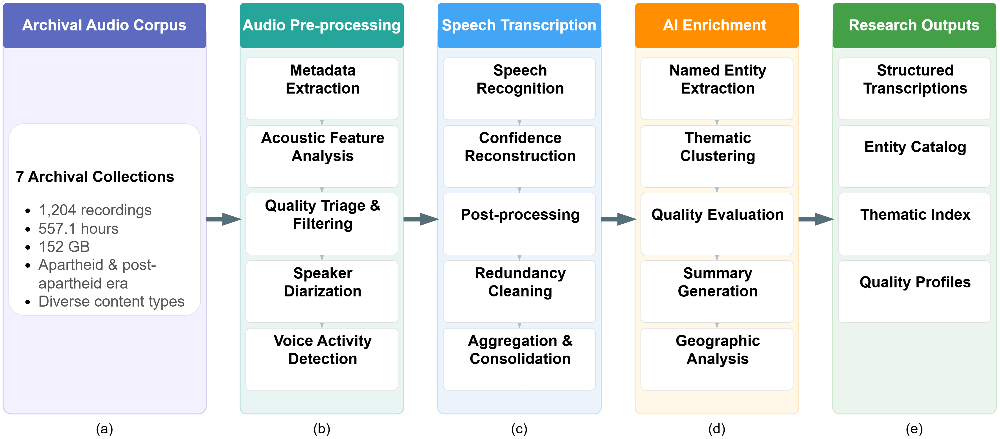
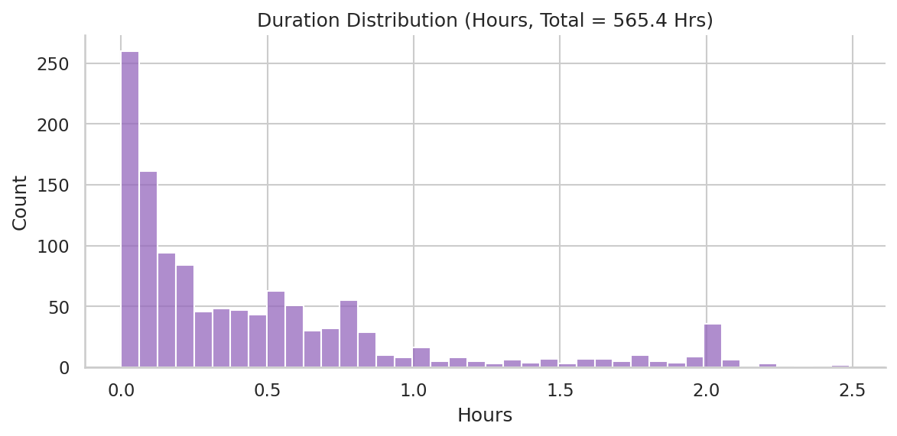
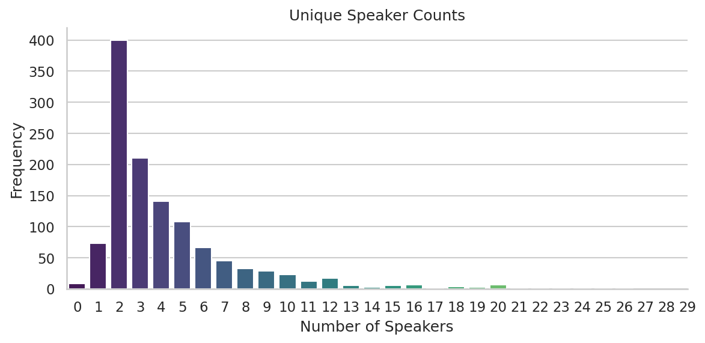
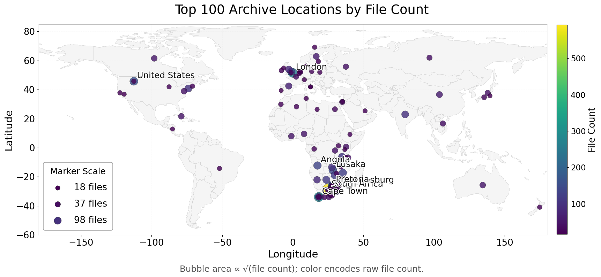
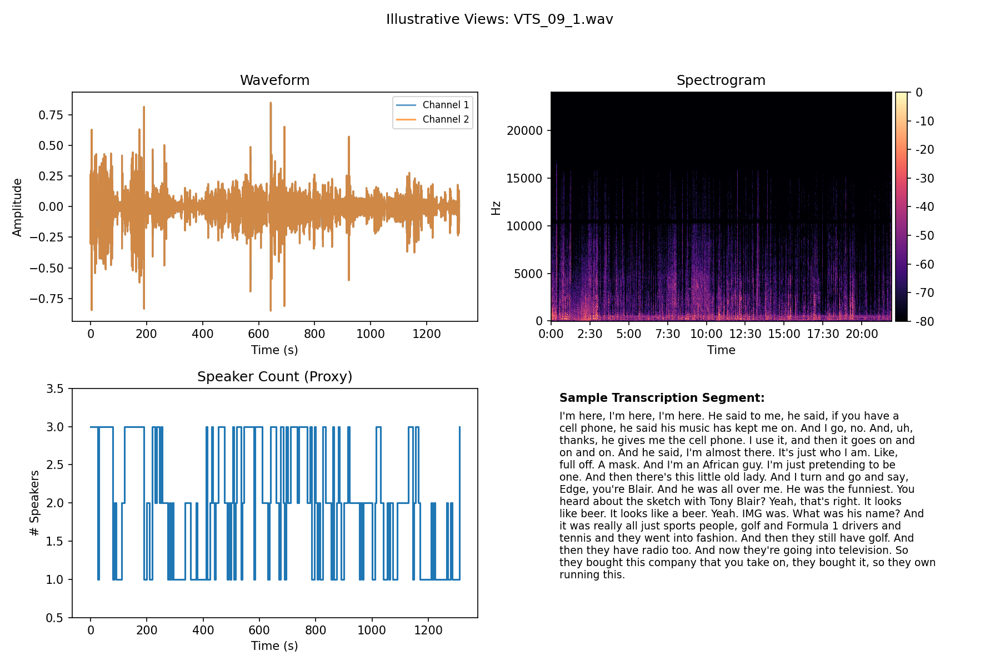
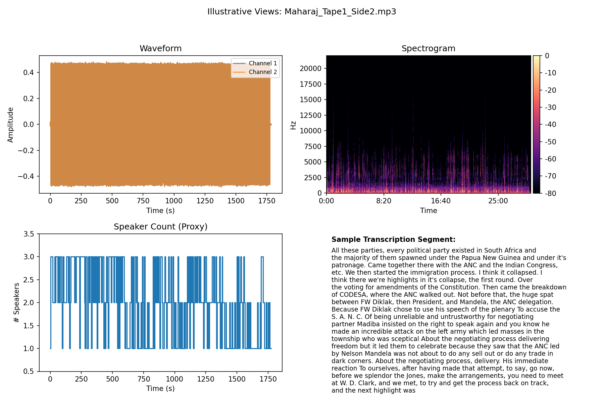

# Ukuvula: Making Nelson Mandela's Legacy Accessible through Large-Scale Transcription

Oral history archives preserve irreplaceable records of lived experience, yet most remain computationally inaccessible due to the prohibitive cost of manual transcription. We present a transcription and enrichment dataset derived from the Nelson Mandela Foundation's audiovisual archive, a major repository of liberation-era oral history. Using WhisperX automatic speech recognition and GPT-4o-powered annotation, we processed 1,204 recordings across seven archival collections spanning South Africa's transition from apartheid to democracy. The resulting dataset, *Ukuvula* (Zulu: "to open"), comprises transcriptions derived from 557.2 hours of archival audio, organized into 17,185 transcript windows (120 seconds each) containing approximately 4.08 million words, enriched with named entities, thematic classifications, and linguistic quality scores. The dataset enables longitudinal discourse analysis of liberation rhetoric, study of multilingual content in English-Afrikaans-isiXhosa political discourse, and text-based NLP benchmarking on transcripts from acoustically heterogeneous archival recordings. All transcription outputs, enrichment annotations, and associated metadata are publicly available at [https://archive.nelsonmandela.org/index.php/ukv](https://archive.nelsonmandela.org/index.php/ukv).

## Pipeline Overview

<p align="center">
  
</p>

**Figure 1.** The Ukuvula pipeline transforms 557.2 hours of archival audio across seven Nelson Mandela Foundation collections into structured, AI-enriched research outputs through five stages: **(a)** Archival audio corpus comprising 1,204 recordings in MP3/WAV formats spanning the apartheid and post-apartheid era; **(b)** Audio pre-processing including metadata extraction, acoustic feature analysis (RMS energy, zero-crossing rate, spectral centroid), quality triage, speaker diarization (pyannote.audio), and voice activity detection; **(c)** Speech transcription via WhisperX large-v2 with forced alignment, confidence reconstruction, post-processing, redundancy cleaning, and 120 s fixed-window aggregation consolidated hierarchically (file → collection → corpus); **(d)** AI enrichment powered by GPT-4o performing named entity extraction (31,686 entities across five categories), thematic clustering (20 predefined themes), five-dimensional quality evaluation, summary generation, and geographic analysis; **(e)** Research outputs including 17,185 provenance-rich transcript segments (4.08 M words), an entity catalog, thematic index, quality profiles, and an interactive semantic search interface.

## Corpus Characteristics

Per-recording technical metadata — including duration, sample rate, channels, speaker count, RMS energy, zero-crossing rate, and spectral centroid — is available in [`results/metadata_analysis.csv`](results/metadata_analysis.csv).

<p align="center">
  
</p>

**Figure 2.** Distribution of recording durations across the archive (N=1,213; mean 28.0 min, median 15.3 min). The heavy right tail reflects multi-hour event recordings; the left-tail mass captures brief archival fragments.

<p align="center">
  
</p>

**Figure 3.** Estimated unique speaker counts per recording via pyannote.audio speaker diarization. Modal cases are single-speaker and two-speaker recordings; the tail of 3–6 speakers reflects multi-participant discussions.

The pipeline extracted 31,686 named entities across five categories (person, organization, location, event, date/time) from the full transcription corpus. The complete entity catalog is available in [`results/entities_extracted.csv`](results/entities_extracted.csv).

<p align="center">
  
</p>

**Figure 4.** Global geographic footprint of the top 100 location entities by distinct file count, derived from the entity catalog. Spatial concentration in Southern Africa reflects regional organizational activity; transnational points (London, United States) indicate diplomatic and advocacy networks.

## Illustrative Examples

<p align="center">
  
  &nbsp;&nbsp;
  
</p>

**Figure 5.** Multi-panel views for two archival recordings showing waveform, spectrogram, proxy speaker trajectory, and sample transcription. Left: VTS_09_1 (Mandela at 90, WAV); Right: Maharaj_Tape1_Side2 (The Authorised Portrait, MP3).

---

## Quick Start

```bash
# 1. Create environment
conda env create -f environment.yml
conda activate nmf

# 2. Configure credentials (copy template, fill in values)
cp .env.example .env
# ⚠️ .env contains secrets — do NOT commit it to source control

# 3. Authenticate with Azure (required for GPT features)
az login

# 4. Run the transcription pipeline
bash run_pipeline.sh large-v2 "data/nmf_recordings/<Collection>"
```

---

## Environment Setup

```bash
conda env create -f environment.yml
conda activate nmf
```

Requires Python 3.10-3.11 and conda. PyTorch and cuDNN are installed via
conda channels (pytorch, nvidia) for reliable GPU setup. Remaining dependencies
are installed via `requirements.txt`, referenced from `environment.yml`.

> **Note**: The pipeline script (`run_pipeline.sh`) expects a conda environment
> named `nmf`. Using conda for PyTorch ensures cuDNN libraries are correctly
> placed in `$CONDA_PREFIX/lib/` without manual symlinks.

### Credentials

Copy `.env.example` to `.env` and fill in the required values:

| Variable | Required For | Description |
|----------|-------------|-------------|
| `AZURE_OPENAI_ENDPOINT` | GPT features (Steps 6-8) | Your Azure OpenAI resource URL |
| `AZURE_OPENAI_MODEL` | GPT features | Deployment name (default: `gpt-4o`) |
| `HUGGINGFACE_TOKEN` | Speaker diarization | HuggingFace access token for pyannote models |

GPT features use Azure AD authentication (`DefaultAzureCredential`). Run `az login` before use.

---

## Pipeline Steps

The pipeline runs sequentially. Steps 1-4 produce the core transcription corpus.
Step 5 is optional redundancy cleaning. Steps 6-8 add GPT-powered enrichment. Step 9 generates analytics.

### Step 1: Generate Metadata

Inventory all audio/video files and extract technical metadata (duration, format, codec).

```bash
python src/analysis/generate_metadata.py                # Basic inventory (ffprobe)
python src/analysis/generate_metadata.py --all          # Full: includes acoustic features
```

**Output**: `results/audiovisual_metadata.csv`

### Step 2: Transcribe

Run WhisperX on a collection directory. Each file produces per-segment transcripts with
confidence scores and timestamps.

```bash
# Single collection
python src/pipeline/create_transcription_main.py \
    --input_dir "data/nmf_recordings/<Collection>" \
    --model_size large-v2 \
    --use_gpu true

# Or use the wrapper script (handles CUDA setup)
bash run_pipeline.sh large-v2 "data/nmf_recordings/<Collection>"
```

Key options: `--chunk_duration` (default: 120s), `--min_confidence` (default: 0.4),
`--enable_diarization` (default: false), `--language` (default: en).

**Output**: `transcription_outputs/<Collection>/<file>.csv` (per-file transcripts)

### Step 3: Aggregate Transcriptions

Consolidate per-file transcripts into collection-level CSVs with 2-minute windows.

```bash
python src/aggregation/aggregate_transcriptions.py
```

**Output**: `results/aggregated_transcriptions/<Collection>.csv`

### Step 4: Build Master Corpus

Merge all collection-level CSVs into a single corpus file.

```bash
python src/aggregation/create_final_transcriptions.py
```

**Output**: `results/final_transcriptions.csv`

### Step 5: Clean Redundancy (optional)

Remove mechanical repetitions and filler stretches while preserving original text.

```bash
python src/enrichment/clean_redundancy_transcriptions.py --input results/final_transcriptions.csv

# Dry run first to inspect metrics
python src/enrichment/clean_redundancy_transcriptions.py --input results/final_transcriptions.csv --dry-run
```

**Output**: `results/final_transcriptions.cleaned.csv`

### Step 6: GPT Entity Extraction (requires Azure OpenAI)

Extract named entities (PERSON, ORGANIZATION, LOCATION, EVENT, DATE_TIME) using GPT-4o.

```bash
python src/enrichment/extract_names_records_match_with_gpt.py
```

**Output**: `results/entities_with_records_gpt.csv`, `results/entity_extraction_analysis_gpt.json`

### Step 7: GPT Collection Summaries (requires Azure OpenAI)

Generate thematic summaries for each archival collection.

```bash
python src/enrichment/generate_collection_summaries.py
```

**Output**: `results/gpt_based_collection_summary.csv`

### Step 8: GPT Thematic Clustering (requires Azure OpenAI)

Classify transcription segments into curated thematic clusters.

```bash
python src/enrichment/gpt_clustering_mandela.py
```

**Output**: `results/gpt_cluster_results.csv`, `results/final_classification_results.json`

### Step 9: Analytics and Figures

Generate exploratory statistics and visualizations from the metadata and transcriptions.

```bash
python src/analysis/metadata_analysis.py
```

**Output**: Figures in `results/metadata_analysis/`

---

## Additional Scripts

| Script | Purpose |
|--------|---------|
| `src/analysis/create_people_recording_counts_summary.py` | Heuristic (non-GPT) person mention counts |
| `src/enrichment/aggregate_transcriptions_scope_note.py` | GPT-generated scope-and-content notes per collection |
| `src/analysis/estimate_unique_speakers.py` | Speaker diarization using pyannote.audio |
| `src/analysis/compute_collection_quality_stats.py` | Collection-level quality statistics for tables |
| `src/analysis/quality_evaluation.py` | GPT-based multi-dimensional transcription quality scoring |

---

## Repository Structure

```
.
├── src/
│   ├── config.py                              # Shared pipeline configuration
│   ├── azure_openai_utils.py                  # Shared Azure OpenAI client setup
│   ├── pipeline/                              # Core ASR transcription
│   │   ├── create_transcription_main.py       # Main transcription orchestrator
│   │   ├── transcriber.py                     # WhisperX model loading and inference
│   │   ├── audio_utils.py                     # Audio loading, resampling, normalization
│   │   ├── postprocess.py                     # Segment cleaning and confidence synthesis
│   │   └── save_utils.py                      # Output persistence (CSV/JSON/TXT)
│   ├── enrichment/                            # GPT-powered enrichment
│   │   ├── extract_names_records_match_with_gpt.py  # GPT entity extraction
│   │   ├── generate_collection_summaries.py   # GPT collection summaries
│   │   ├── gpt_clustering_mandela.py          # GPT thematic clustering
│   │   ├── aggregate_transcriptions_scope_note.py   # GPT scope-and-content notes
│   │   └── clean_redundancy_transcriptions.py # Redundancy cleaning
│   ├── analysis/                              # Analytics and quality
│   │   ├── metadata_analysis.py               # Exploratory analytics
│   │   ├── quality_evaluation.py              # GPT-based quality scoring
│   │   ├── compute_collection_quality_stats.py    # Collection quality statistics
│   │   ├── generate_metadata.py               # Audio/video metadata extraction
│   │   ├── estimate_unique_speakers.py        # Speaker diarization (pyannote)
│   │   └── create_people_recording_counts_summary.py  # Person mention counts
│   └── aggregation/                           # Corpus building
│       ├── aggregate_transcriptions.py        # Collection-level consolidation
│       └── create_final_transcriptions.py     # Corpus-level merge
├── run_pipeline.sh                            # Pipeline wrapper with CUDA setup
├── setup_environment.sh                       # Conda environment setup
├── requirements.txt                           # Pinned Python dependencies
├── environment.yml                            # Conda environment specification
├── .env.example                               # Environment variable template
├── figures/                                   # Figures for README and documentation
│   ├── ukuvula_overview.png                   # Pipeline overview diagram
│   ├── top_locations_world_overlay_pub.png    # Geographic entity map
│   ├── metadata_analysis/                     # Corpus characterization plots
│   └── examples/                              # Illustrative recording panels
├── LICENSE                                    # MIT License
└── THIRD_PARTY_NOTICES.md                     # Third-party license attributions
```

### Output Directories

| Directory | Tracked | Contents |
|-----------|---------|----------|
| `data/` | No | Input audio/video files |
| `transcription_outputs/` | No | Per-file transcription CSVs |
| `results/` | Yes | Derived artifacts (metadata, entities, aggregated transcripts, clusters, figures) |
| `logs/` | No | Pipeline execution logs |

---

## Configuration

All pipeline parameters are defined in `src/config.py` with sensible defaults.
Override via environment variables or CLI arguments:

| Parameter | Default | Env Override | Description |
|-----------|---------|-------------|-------------|
| Model size | `large-v2` | `WHISPER_MODEL_SIZE` | WhisperX model variant |
| Language | `en` | `WHISPER_LANGUAGE` | Transcription language |
| Batch size | `32` | `WHISPER_BATCH_SIZE` | Inference batch size (tune for GPU memory) |
| Confidence threshold | `0.4` | — | Minimum segment confidence |
| Chunk duration | `120s` | — | Audio chunk length for processing |
| VAD method | `pyannote` | `WHISPER_VAD_METHOD` | Voice activity detection backend |

---

## Error Handling

- Per-file try/except with logging; failures never abort the batch.
- Chunk fallback when zero segments detected (prevents empty outputs).
- Confidence safety: always retains first non-empty segment per file.
- GPT scripts checkpoint intermediates every 500-1000 segments.
- Graceful degradation when optional dependencies (diarization, alignment) are missing.

---

## Reproducibility

| Item | Status |
|------|--------|
| Environment file | `environment.yml` / `requirements.txt` (pinned) |
| Deterministic flag | `WHISPERX_CUDA_PATCH=1` for cuDNN determinism |
| Random seeds | Set (e.g., 42) in clustering and sampling |
| Provenance columns | Collection/file/window tracked everywhere |
| Intermediate artifacts | GPT classification and entity checkpoints retained |
| Corpus rebuild | `src/aggregation/create_final_transcriptions.py` |

---

## Security and Privacy

- No raw audio is redistributed; transcripts may contain personal names.
- API credentials are loaded from environment variables (`.env`), never hardcoded.
- Review transcripts for PII before any public release of derived data.

---

## Citation

```bibtex
@article{nmf2025ukuvula,
  title   = {Ukuvula: Making Nelson Mandela's Legacy Accessible
             through Large-Scale Transcription},
  author  = {TBD},
  year    = {2025},
  journal = {Scientific Data (under preparation)}
}
```

---

## Code of Conduct

This project has adopted the
[Microsoft Open Source Code of Conduct](https://opensource.microsoft.com/codeofconduct/).
For more information see the [FAQ](https://opensource.microsoft.com/codeofconduct/faq/)
or contact [opencode@microsoft.com](mailto:opencode@microsoft.com).

---

## License

This project is licensed under the [MIT License](LICENSE).

Copyright (c) Microsoft Corporation. All rights reserved.

See [THIRD_PARTY_NOTICES.md](THIRD_PARTY_NOTICES.md) for third-party license attributions.

---

## Trademarks

This project may contain trademarks or logos for projects, products, or services. Authorized use of Microsoft trademarks or logos is subject to and must follow [Microsoft's Trademark & Brand Guidelines](https://www.microsoft.com/en-us/legal/intellectualproperty/trademarks/usage/general). Use of Microsoft trademarks or logos in modified versions of this project must not cause confusion or imply Microsoft sponsorship. Any use of third-party trademarks or logos are subject to those third-party's policies.
